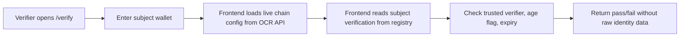

# ProofPass

ProofPass is a live privacy-first verification demo.

The product promise is simple:

> Prove the fact, not the data.

Today the demo proves an `age > 18` claim without putting the source identity
document on-chain.

## What The Product Does

ProofPass has two main user-facing flows:

- `Issue`: upload an ID image, extract the required fields through the OCR
  verifier, generate a signed age attestation, and store only that attestation
  on-chain.
- `Verify`: enter a wallet address and read the latest verifier-backed age
  attestation from the registry.

The live frontend is deployed on Railway and uses a Railway-hosted OCR API plus
the Polygon Amoy testnet contract.

## Core Product Rules

- Raw personal data is handled off-chain.
- The OCR verifier signs only the public attestation payload.
- The blockchain is the trust anchor, not the document store.
- The verifier sees pass/fail, signer, and validity window, not the source ID.

## Live Architecture

- Frontend: Next.js + Tailwind
- OCR API: FastAPI on Railway
- OCR extraction: OpenRouter vision model path
- Wallet and chain calls: Ethers.js + browser wallet
- Network: Polygon Amoy
- Registry: verifier-backed age attestation contract

## User Flow

```mermaid
flowchart LR
    A["User opens /identity"] --> B["Connect subject wallet"]
    B --> C["Upload ID or passport image"]
    C --> D["Frontend sends image to OCR API"]
    D --> E["OCR API extracts fields off-chain"]
    E --> F["OCR API builds signed age attestation"]
    F --> G["Frontend reviews extracted result"]
    G --> H["User submits attestation on-chain"]
    H --> I["Registry stores verifier-backed record"]
    I --> J["User opens /verify to confirm result"]
```



## Verifier Flow



## Data Boundaries

### Off-chain

- uploaded image
- OCR text
- extracted name and date of birth
- operator review state

### On-chain

- subject wallet
- `isOver18`
- quality score
- commitment hash
- issue and expiry timestamps
- verifier signature-derived attestation record

## Current Routes

- `/`: landing page and product framing
- `/identity`: OCR-backed issuance flow
- `/verify`: verifier read path
- `/issued`: lifecycle explainer

## Local Development

From [/Users/raven/Desktop/vibe-hack-101-project/proofpass_package](/Users/raven/Desktop/vibe-hack-101-project/proofpass_package):

```bash
npm install
npm run dev
```

Useful commands:

```bash
npm run typecheck
npm run build
```

## Environment

The frontend can be pointed at any OCR API that exposes:

- `GET /health`
- `GET /settings/public`
- `POST /ocr/id-card/file`

Local example:

```bash
NEXT_PUBLIC_OCR_API_URL=http://127.0.0.1:8001
```

In production, the frontend uses the deployed OCR API and reads chain, contract,
and verifier settings dynamically from `GET /settings/public`.

## Notes

- The project uses separate Next output directories for dev and build to avoid
  stale output issues.
- The cleanup script is Railway-safe and no longer removes mounted cache paths
  during cloud builds.
- This is not a zero-knowledge system. It is a minimal privacy-preserving demo
  with explicit trust in the verifier.
